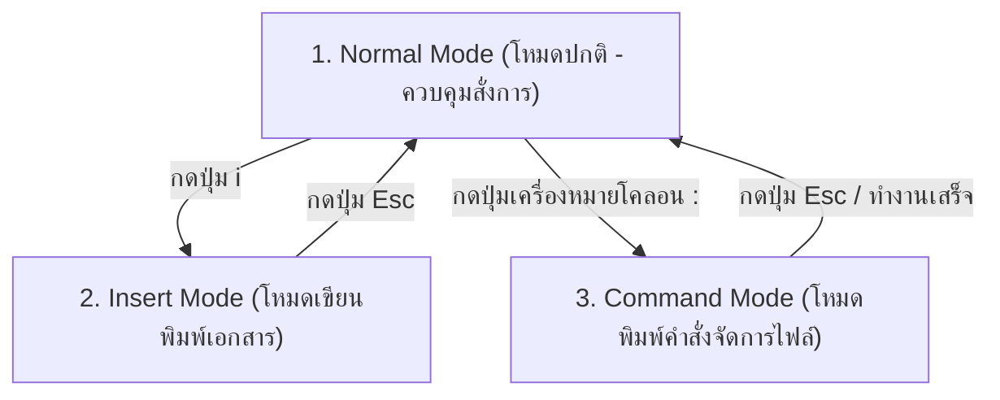

# คู่มือการดูและแก้ไขไฟล์ข้อมูล (File Viewing & Editing) อย่างละเอียด

ทำความเข้าใจและเรียนรู้วิธีการเข้าถึง อ่านเนื้อหาไฟล์ข้อมูลขนาดต่างๆ การวิเคราะห์ล็อกการทำงานสดแบบเรียลไทม์ ตลอดจนการใช้งานเครื่องมือแก้ไขข้อความ (Text Editors) บนเทอร์มินัลผ่านระบบ Command Line บน Linux

---

## 📖 1. เครื่องมือสำหรับเปิดอ่านและตรวจสอบไฟล์ข้อมูล (File Readers)

บ่อยครั้งที่เราต้องการเพียงแค่อ่านดูค่าการตั้งค่า ปัญหาของ Log หรือส่องดูข้อมูลเบื้องต้นของไฟล์โดยไม่ได้ต้องการจะแก้ไขอะไร Linux มีหลากหลายโปรแกรมที่ถูกสร้างขึ้นมาเพื่อให้เหมาะสมกับขนาดและรูปแบบการทำงานที่แตกต่างกัน:

### A. คำสั่ง `cat` (Concatenate)
* **คำอธิบาย:** ใช้สำหรับแสดงเนื้อหาทั้งหมดของไฟล์ออกมาทางหน้าจอในครั้งเดียว เหมาะสำหรับไฟล์ที่มีความยาวไม่กี่บรรทัด หรือใช้เชื่อมต่อเนื้อหาหลายไฟล์เข้าด้วยกัน
* **ออปชันย่อยที่สำคัญ:**
  * `-n` : แสดงหมายเลขแถวบรรทัดหน้าข้อความ (มีประโยชน์มากเวลาต้องการระบุจุดแก้ไขกับเพื่อนร่วมงาน)
  * `-b` : แสดงหมายเลขแถวบรรทัดเฉพาะบรรทัดที่มีข้อความอยู่จริง (ข้ามบรรทัดว่างเปล่า)
* **ตัวอย่างการรัน:**
  ```bash
  # เปิดอ่านเนื้อหาทั้งหมดของไฟล์ .env
  cat .env
  
  # เปิดอ่านเนื้อหาไฟล์กำหนดค่าพร้อมแจ้งหมายเลขบรรทัด
  cat -n /etc/resolv.conf
  
  # รวมไฟล์ text1.txt และ text2.txt ไปเซฟเก็บไว้เป็นไฟล์ใหม่ชื่อ combined.txt
  cat text1.txt text2.txt > combined.txt
  ```

### B. คำสั่ง `less`
* **คำอธิบาย:** ใช้สำหรับการเปิดอ่านไฟล์ข้อมูลที่มีความยาวมากๆ หรือขนาดใหญ่ (เช่น ไฟล์ log ขนาดใหญ่) โดยโปรแกรมนี้จะไม่โหลดเนื้อหาของไฟล์ทั้งหมดเข้ามาในแรมตั้งแต่แรก ทำให้เปิดไฟล์ขนาดกิกะไบต์ได้รวดเร็วทันที และใช้วิธีเลื่อนอ่านทีละหน้าอย่างยืดหยุ่น
* **ตัวอย่างการรัน:**
  ```bash
  less /var/log/syslog
  ```
* **ปุ่มควบคุมการทำงานขณะอ่าน:**
  * **`ปุ่มลูกศรขึ้น / ลง` :** เลื่อนหน้ากระดาษขึ้นหรือลงทีละ 1 บรรทัด
  * **`Spacebar` หรือ `Page Down` :** เลื่อนลงด้านล่างทีละ 1 หน้าจอเต็ม
  * **`Page Up` :** เลื่อนขึ้นด้านบนทีละ 1 หน้าจอเต็ม
  * **`g` (ตัวพิมพ์เล็ก):** กระโดดไปยังบรรทัดแรกสุดของไฟล์ทันที
  * **`G` (ตัวพิมพ์ใหญ่):** กระโดดไปยังบรรทัดสุดท้ายส่วนท้ายของไฟล์ทันที
  * **`/ข้อความที่ต้องการค้นหา` :** พิมพ์เพื่อค้นหาคำสำคัญภายในไฟล์ (เช่น `/error` แล้วกด Enter)
    * กดปุ่ม **`n`** : เพื่อกระโดดไปยังคำที่ค้นพบถัดไป (Next match)
    * กดปุ่ม **`N`** (Shift + n) : เพื่อย้อนกลับไปยังคำค้นพบก่อนหน้า
  * **`q` (Quit):** กดปุ่มนี้เพื่อปิดไฟล์และออกจากหน้าอ่าน กลับสู่เทอร์มินัลปกติ

### C. คำสั่ง `head`
* **คำอธิบาย:** แสดงผลเฉพาะส่วนหัวตอนต้น (แถวบนสุด) ของไฟล์ข้อมูล
* **ออปชันย่อยที่สำคัญ:**
  * `-n <จำนวนบรรทัด>` : กำหนดจำนวนแถวที่ต้องการให้อ่าน (ค่าเริ่มต้นของระบบหากไม่พิมพ์ระบุจะแสดง 10 บรรทัดแรกสุด)
* **ตัวอย่างการรัน:**
  ```bash
  # แสดงเนื้อหา 10 บรรทัดแรกของไฟล์
  head database.sql
  
  # แสดงเนื้อหา 25 บรรทัดแรกสุดของไฟล์
  head -n 25 database.sql
  ```

### D. คำสั่ง `tail`
* **คำอธิบาย:** แสดงผลเฉพาะส่วนท้าย (แถวล่างสุด) ของไฟล์ข้อมูล
* **ออปชันย่อยที่สำคัญ:**
  * `-n <จำนวนบรรทัด>` : กำหนดจำนวนแถวด้านล่างสุดที่ต้องการให้อ่าน (ค่าเริ่มต้นหากไม่ระบุคือ 10 บรรทัดสุดท้าย)
  * `-f` (Follow) : **ฟังก์ชันสำคัญที่สุด** สำหรับเกาะติดความเคลื่อนไหวของไฟล์แบบเรียลไทม์ เมื่อมีระบบบันทึก Log ใหม่ต่อท้ายไฟล์ หน้าจอจะทำการเลื่อนและพิมพ์บรรทัดใหม่แสดงขึ้นมาให้ดูแบบอัตโนมัติทันที
* **ตัวอย่างการรัน:**
  ```bash
  # ดูประวัติ Log 30 บรรทัดสุดท้ายของ nginx
  tail -n 30 /var/log/nginx/access.log
  
  # เฝ้ามองดูการทำงานของ Log ระบบแบบเรียลไทม์สดๆ
  tail -f /var/log/syslog
  ```
  > [!TIP]
  > **การออกจากสถานะเฝ้าดู `tail -f`:**
  > เมื่อต้องการยกเลิกหรือหยุดการเชื่อมต่อเฝ้าดู ให้กดปุ่มคีย์ลัด **`Ctrl + C`** บนคีย์บอร์ดของคุณเพื่อปิดการทำงาน

---

## 📝 2. เครื่องมือแก้ไขไฟล์ข้อมูลยอดนิยม (Terminal Text Editors)

บนสภาพแวดล้อมที่ไม่มีหน้าต่าง UI (Command Line Only) คุณไม่สามารถใช้เมาส์คลิกเปิด Notepad ได้ การแก้ไขไฟล์คอนฟิกต่างๆ จึงต้องทำผ่านโปรแกรมแก้ไขข้อความที่รันบนเทอร์มินัลโดยตรง ซึ่งมี 2 ตัวเลือกที่นิยมใช้กันแพร่หลายที่สุด:

---

### 🟢 A. เครื่องมือ `nano` (สำหรับผู้เริ่มต้น / ใช้งานง่าย)
* **คำอธิบาย:** เป็นเครื่องมือแก้ไขข้อความที่เรียนรู้เร็วและไม่ซับซ้อน มีเมนูคำสั่งและคีย์ลัดช่วยเหลือบอกอยู่บริเวณด้านล่างของหน้าต่างพิมพ์งานเสมอ
* **ตัวอย่างการรันแก้ไขไฟล์:**
  ```bash
  nano /etc/nginx/nginx.conf
  ```
  *(หากไม่มีสิทธิ์บันทึก ให้พิมพ์คำว่า `sudo nano ...` นำหน้าเพื่อเข้าแก้ไขด้วยสิทธิ์แอดมิน)*

* **ปุ่มควบคุมการทำงานที่จำเป็น (ใช้ปุ่ม `Ctrl` ร่วมด้วย):**
  * **`Ctrl + O` (WriteOut):** สั่งบันทึกข้อมูลที่พิมพ์แก้ไขลงในไฟล์ (เมื่อกดแล้ว ให้กดปุ่ม `Enter` อีก 1 ครั้งเพื่อยืนยันชื่อไฟล์)
  * **`Ctrl + X` (Exit):** สั่งปิดโปรแกรมและออกจากไฟล์
    * *หมายเหตุ:* หากคุณแก้ไขข้อความแล้วแต่ยังไม่ได้เซฟ เมื่อกด `Ctrl + X` ระบบจะถามย้ำว่า **"Save modified buffer?"** 
    * กด **`y`** เพื่อเซฟและออก
    * กด **`n`** เพื่อลบสิ่งแก้ไขทิ้งทั้งหมดและออกทันที
    * กด **`Ctrl + C`** เพื่อกดยกเลิกและพิมพ์ต่อ
  * **`Ctrl + W` (Where Is):** เปิดเมนูพิมพ์คำค้นหาข้อความภายในไฟล์
  * **`Ctrl + K` (Cut):** ตัดข้อความทั้งบรรทัดที่เคอร์เซอร์อยู่ (เสมือนการสั่ง Cut/ลบบรรทัด)
  * **`Ctrl + U` (Paste/Uncut):** กดเพื่อวางเนื้อหาบรรทัดที่เพิ่งทำการตัดด้วย Ctrl + K ลงไปตรงบรรทัดปัจจุบัน

---

### 🔴 B. เครื่องมือ `vi` หรือ `vim` (ระดับโปรแกรมเมอร์ / ฟังก์ชันสูง)
* **คำอธิบาย:** เป็น Text Editor ยุคเก๋าที่มีความเร็วและมีประสิทธิภาพสูงมาก ติดตั้งอยู่ในระบบปฏิบัติการ Linux แทบทุกตระกูล แต่ใช้งานยากกว่าปกติเพราะมีแนวคิดการแบ่งโหมดการทำงานออกเป็นสถานะต่างๆ (Modes) 

* **ตัวอย่างการรันแก้ไขไฟล์:**
  ```bash
  vi config.yaml
  ```

#### 🛡️ การทำความเข้าใจ 3 โหมดหลักของ vi/vim:
เมื่อเริ่มต้นเปิดโปรแกรมเข้ามา คุณจะยังพิมพ์เนื้อหาข้อความไม่ได้ทันที เนื่องจากระบบกำลังอยู่ในโหมดอื่นอยู่ โดยระบบจะทำงานสลับกันไปมาระหว่างโหมดดังนี้:



#### 1. Normal Mode (โหมดปกติ)
* เป็นโหมดเริ่มต้นทุกครั้งที่เปิดไฟล์เข้ามา ในโหมดนี้คีย์บอร์ดของคุณจะทำหน้าที่เป็นปุ่มลัดสั่งงาน ไม่ใช่สำหรับการพิมพ์หนังสือ (เช่น เลื่อนเคอร์เซอร์, ลบตัวอักษร, ก๊อปปี้คำ)
* **วิธีการย้ายจากโหมดอื่นกลับมาโหมดปกติ:** กดปุ่ม **`Esc`** บนคีย์บอร์ด 1-2 ครั้ง

#### 2. Insert Mode (โหมดสำหรับพิมพ์เขียน)
* ใช้สำหรับแทรกคำ เขียนโค้ด และพิมพ์ข้อความลงในเอกสาร
* **วิธีการเข้าสู่โหมดนี้:** ขณะอยู่ Normal Mode ให้กดปุ่มตัวอักษร **`i`** บนคีย์บอร์ด (จะสังเกตเห็นคำว่า `-- INSERT --` ปรากฏขึ้นมาที่ขอบซ้ายล่างสุด แสดงว่าเริ่มพิมพ์งานได้เลย)

#### 3. Command Mode (โหมดป้อนคำสั่ง)
* ใช้สำหรับพิมพ์สั่งการระบบ เช่น ค้นหา เซฟข้อมูล หรือสั่งออกจากไฟล์
* **วิธีการเข้าสู่โหมดนี้:** ขณะอยู่ Normal Mode ให้กดปุ่มเครื่องหมายโคลอน **`:`** บนคีย์บอร์ด (จะปรากฏสัญลักษณ์ `:` ด้านล่างสุดเพื่อให้เราพิมพ์คำสั่ง)

#### 🔑 รายการคำสั่งสำคัญใน Command Mode (พิมพ์ต่อท้ายเครื่องหมาย `:`):
เมื่ออยู่ในโหมดป้อนคำสั่ง ให้ป้อนตัวย่อเหล่านี้แล้วกด `Enter`:

* **`:w`** (Write) : บันทึกข้อมูลการพิมพ์แก้ไขลงในดิสก์
* **`:q`** (Quit) : ออกจากโปรแกรม (จะออกได้ต่อเมื่อไม่มีการแก้ไขค้างอยู่เท่านั้น)
* **`:q!`** (Force Quit) : บังคับออกจากโปรแกรมทันทีโดยปฏิเสธและไม่เซฟข้อมูลที่แก้ไขล่าสุด
* **`:wq`** หรือ **`:x`** (Write & Quit) : บันทึกข้อมูลและปิดออกจากโปรแกรมทันที (คำสั่งที่ถูกหยิบมาใช้บ่อยที่สุดก่อนปิด)
* **`:set nu`** (Set Number) : แสดงแถวเลขบรรทัดในไฟล์เพื่อช่วยตรวจสอบแถวข้อความ
* **`/คำค้นหา`** (สืบค้น) : พิมพ์คำสืบค้นในโหมดปกติ เช่น `/database` แล้วกด Enter
  * กดปุ่ม **`n`** เพื่อกระโดดไปหาคำค้นถัดไป
  * กดปุ่ม **`N`** เพื่อสลับกลับไปค้นหาตำแหน่งก่อนหน้า
