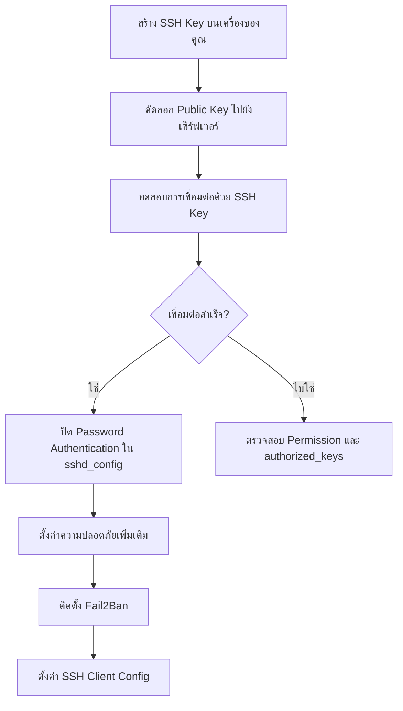

# การตั้งค่าและใช้งาน SSH
 
SSH (Secure Shell) คือโปรโตคอลสำหรับเชื่อมต่อและควบคุมเครื่องเซิร์ฟเวอร์จากระยะไกลอย่างปลอดภัย โดยข้อมูลทั้งหมดที่ส่งผ่านจะถูกเข้ารหัส ทำให้ไม่สามารถดักอ่านได้
 
## SSH Key คืออะไร?
 
SSH Key คือคู่กุญแจเข้ารหัสสองชิ้นที่ทำงานร่วมกัน:
 
- **Private Key** — เก็บไว้บนเครื่องของคุณเท่านั้น ห้ามแชร์ให้ใคร
- **Public Key** — นำไปวางไว้บนเซิร์ฟเวอร์ที่ต้องการเข้าถึง
เมื่อเชื่อมต่อ SSH จะใช้กุญแจทั้งสองชิ้นตรวจสอบตัวตนแทนรหัสผ่าน ซึ่งปลอดภัยกว่ามากและสะดวกกว่า เพราะไม่ต้องพิมพ์รหัสผ่านทุกครั้ง
 
:::tip 
แนะนำให้ใช้ Ed25519
อัลกอริทึมที่แนะนำสำหรับการสร้าง SSH Key ในปัจจุบันคือ **Ed25519** เนื่องจากปลอดภัยกว่า RSA, คีย์สั้นกว่า และรองรับโดยระบบสมัยใหม่ทุกระบบ
:::
 
---
 
## การสร้าง SSH Key ทุกแพลตฟอร์ม
 
### Linux และ macOS
 
ทั้ง Linux และ macOS มี OpenSSH ติดตั้งมาให้พร้อมใช้งาน
 
**เปิด Terminal แล้วรันคำสั่งนี้:**
 
```bash
ssh-keygen -t ed25519 -C "your_email@example.com"
```
 
ระบบจะถามตำแหน่งบันทึกไฟล์ (กด Enter เพื่อใช้ค่าเริ่มต้น) และ passphrase สำหรับป้องกัน Private Key
 
```
Generating public/private ed25519 key pair.
Enter file in which to save the key (/home/user/.ssh/id_ed25519): [Enter]
Enter passphrase (empty for no passphrase): ••••••••
Enter same passphrase again: ••••••••
Your identification has been saved in /home/user/.ssh/id_ed25519
Your public key has been saved in /home/user/.ssh/id_ed25519.pub
```
 
ไฟล์จะถูกบันทึกที่:
- `~/.ssh/id_ed25519` — Private Key
- `~/.ssh/id_ed25519.pub` — Public Key
**ดู Public Key ของคุณ:**
 
```bash
cat ~/.ssh/id_ed25519.pub
```
 
---
 
### Windows (PowerShell / Command Prompt)
 
Windows 10 เวอร์ชัน 1809 ขึ้นไปและ Windows 11 มี OpenSSH ติดมาให้แล้ว สามารถใช้คำสั่งเดียวกับ Linux ได้เลย
 
**เปิด PowerShell หรือ Command Prompt แล้วรัน:**
 
```powershell
ssh-keygen -t ed25519 -C "your_email@example.com"
```
 
ไฟล์จะถูกบันทึกที่:
- `C:\Users\<ชื่อผู้ใช้>\.ssh\id_ed25519` — Private Key
- `C:\Users\<ชื่อผู้ใช้>\.ssh\id_ed25519.pub` — Public Key
:::note
หาก OpenSSH ยังไม่ได้ติดตั้ง ให้ไปที่ **Settings → Apps → Optional Features** แล้วค้นหา "OpenSSH Client" และติดตั้ง
:::
 
**ดู Public Key ของคุณ:**
 
```powershell
type $env:USERPROFILE\.ssh\id_ed25519.pub
```
 
---
 
### Windows (Git Bash)
 
หากติดตั้ง Git for Windows ไว้ สามารถใช้ Git Bash ซึ่งรองรับคำสั่ง Linux ได้ทุกอย่าง
 
```bash
ssh-keygen -t ed25519 -C "your_email@example.com"
```
 
---
 
### iOS / Android (Termius)
 
สำหรับผู้ใช้มือถือที่ต้องการสร้าง SSH Key สามารถใช้แอป **Termius**:
 
1. ติดตั้ง Termius จาก App Store / Google Play
2. เข้าไปที่ **Settings → Keychain → Generate Key**
3. เลือกประเภท **Ed25519**
4. ตั้งชื่อ Key แล้วกด Save
5. คัดลอก Public Key เพื่อนำไปใส่บนเซิร์ฟเวอร์
---
 
## การสร้าง SSH Key หลายคู่พร้อมตั้งชื่อไฟล์
 
เมื่อต้องการใช้ Key ต่างกันในแต่ละเซิร์ฟเวอร์หรือบริการ (เช่น GitHub, GitLab, Production Server) ให้สร้าง Key แยกโดยระบุชื่อไฟล์:
 
```bash
# Key สำหรับ GitHub
ssh-keygen -t ed25519 -C "github" -f ~/.ssh/id_ed25519_github
 
# Key สำหรับ Production Server
ssh-keygen -t ed25519 -C "prod-server" -f ~/.ssh/id_ed25519_prod
 
# Key สำหรับ GitLab
ssh-keygen -t ed25519 -C "gitlab" -f ~/.ssh/id_ed25519_gitlab
```
 
หลังสร้างแล้วจะได้ไฟล์ดังนี้:
 
```
~/.ssh/
├── id_ed25519_github
├── id_ed25519_github.pub
├── id_ed25519_prod
├── id_ed25519_prod.pub
├── id_ed25519_gitlab
└── id_ed25519_gitlab.pub
```
 
---
 
## การเพิ่ม SSH Key เข้าระบบเซิร์ฟเวอร์
 
### วิธีที่ 1: ใช้คำสั่ง ssh-copy-id (แนะนำ)
 
```bash
ssh-copy-id -i ~/.ssh/id_ed25519.pub username@server_ip
```
 
คำสั่งนี้จะ:
1. เชื่อมต่อไปยังเซิร์ฟเวอร์ด้วยรหัสผ่าน
2. เพิ่ม Public Key เข้าไปใน `~/.ssh/authorized_keys` อัตโนมัติ
3. ตั้งค่า Permission ให้ถูกต้องอัตโนมัติ
ระบุ Key ไฟล์อื่น:
 
```bash
ssh-copy-id -i ~/.ssh/id_ed25519_prod.pub username@server_ip
```
 
### วิธีที่ 2: คัดลอกด้วยตนเอง
 
```bash
# บนเครื่องของคุณ — คัดลอก Public Key
cat ~/.ssh/id_ed25519.pub
```
 
จากนั้น login เข้าเซิร์ฟเวอร์ แล้วรันคำสั่ง:
 
```bash
# บนเซิร์ฟเวอร์
mkdir -p ~/.ssh
chmod 700 ~/.ssh
echo "วางเนื้อหา Public Key ที่คัดลอกมาที่นี่" >> ~/.ssh/authorized_keys
chmod 600 ~/.ssh/authorized_keys
```
 
### ทดสอบการเชื่อมต่อ
 
```bash
ssh username@server_ip
# หรือระบุ Key ไฟล์
ssh -i ~/.ssh/id_ed25519_prod username@server_ip
```
 
---
 
## การเพิ่มความปลอดภัยให้ SSH
 
:::warning สำคัญ
ก่อนปรับแต่งค่า SSH ให้สร้าง backup ไฟล์ config ไว้ก่อนทุกครั้ง และเปิด session เชื่อมต่ออีกอันค้างไว้ เพื่อป้องกันการถูก lock out
:::
 
### ขั้นตอนที่ 1: สำรองไฟล์ sshd_config
 
```bash
sudo cp /etc/ssh/sshd_config /etc/ssh/sshd_config.bak.$(date +%Y%m%d)
```
 
### ขั้นตอนที่ 2: แก้ไขไฟล์ sshd_config
 
```bash
sudo nano /etc/ssh/sshd_config
```
 
### การตั้งค่าที่แนะนำ
 
```bash title="/etc/ssh/sshd_config"
# ปิดการ Login ด้วย Root โดยตรง
PermitRootLogin no
 
# ปิดการ Login ด้วยรหัสผ่าน (เปิดหลังจากเพิ่ม SSH Key แล้วเท่านั้น!)
PasswordAuthentication no
 
# เปิดใช้ SSH Key Authentication
PubkeyAuthentication yes
 
# เปลี่ยน Port (ลดการโดน brute-force อัตโนมัติ)
Port 2222
 
# จำกัด login attempts
MaxAuthTries 3
 
# ปิดการ forward X11 (ถ้าไม่ต้องการใช้ GUI)
X11Forwarding no
 
# ตั้งค่า Timeout (วินาที)
ClientAliveInterval 300
ClientAliveCountMax 2
 
# จำกัดจำนวน concurrent unauthenticated connections
MaxStartups 10:30:60
 
# อนุญาตเฉพาะ user ที่ระบุ (ถ้าต้องการ)
AllowUsers ubuntu deploy
```
 
### ขั้นตอนที่ 3: ตรวจสอบ syntax ก่อน restart
 
```bash
sudo sshd -t
```
 
ถ้าไม่มี output แสดงว่า config ถูกต้อง
 
### ขั้นตอนที่ 4: Reload SSH Service
 
```bash
sudo systemctl reload ssh
# หรือ
sudo systemctl restart ssh
```
 
### ติดตั้ง Fail2Ban (ป้องกัน Brute Force)
 
Fail2Ban จะ ban IP อัตโนมัติเมื่อมีการ login ผิดพลาดเกินจำนวนที่กำหนด
 
```bash
sudo apt update
sudo apt install fail2ban -y
```
 
สร้างไฟล์ config สำหรับ SSH:
 
```bash
sudo nano /etc/fail2ban/jail.d/ssh.conf
```
 
```ini title="/etc/fail2ban/jail.d/ssh.conf"
[sshd]
enabled = true
port = 2222
filter = sshd
logpath = /var/log/auth.log
maxretry = 5
bantime = 3600
findtime = 600
```
 
```bash
sudo systemctl enable fail2ban
sudo systemctl start fail2ban
 
# ดูสถานะ
sudo fail2ban-client status sshd
```
 
### ตั้งค่า Firewall (UFW) สำหรับ SSH
 
```bash
# อนุญาต SSH Port ใหม่
sudo ufw allow 2222/tcp
 
# ถ้ายังไม่ได้เปิด UFW
sudo ufw enable
 
# ดูสถานะ
sudo ufw status
```
 
---
 
## SSH Key ส่วนกลาง — ใช้ร่วมกันหลาย User
 
ปกติแต่ละ user จะมี `~/.ssh/authorized_keys` ของตัวเอง แต่ในสภาพแวดล้อมที่มีหลาย user เช่น `ubuntu`, `deploy`, `www-data` การดูแลหลายไฟล์พร้อมกันนั้นยุ่งยาก
 
**วิธีแก้คือ ใช้ `AuthorizedKeysFile` ใน sshd_config เพื่อชี้ไปยัง Key ส่วนกลาง**
 
### วิธีที่ 1: Global Key ไฟล์เดียวสำหรับทุก User
 
```bash
# สร้างโฟลเดอร์และไฟล์ Key กลาง
sudo mkdir -p /etc/ssh/authorized_keys
sudo touch /etc/ssh/authorized_keys/global
sudo chmod 644 /etc/ssh/authorized_keys/global
 
# เพิ่ม Public Key เข้าไป
sudo nano /etc/ssh/authorized_keys/global
```
 
แก้ไข `/etc/ssh/sshd_config`:
 
```bash
# ค้นหาบรรทัด AuthorizedKeysFile และแก้ไขเป็น:
AuthorizedKeysFile .ssh/authorized_keys /etc/ssh/authorized_keys/global
```
 
ด้วยการตั้งค่านี้ SSH จะตรวจสอบ Key จากทั้งสองตำแหน่ง:
1. `~/.ssh/authorized_keys` — Key เฉพาะของแต่ละ user
2. `/etc/ssh/authorized_keys/global` — Key ส่วนกลางที่ใช้ได้กับทุก user
```bash
sudo systemctl reload ssh
```
 
### วิธีที่ 2: Global Key แยกตาม Group
 
สำหรับระบบที่มีหลายกลุ่ม เช่น admin กับ developer:
 
```bash
sudo mkdir -p /etc/ssh/global_keys
sudo touch /etc/ssh/global_keys/admins
sudo touch /etc/ssh/global_keys/devs
sudo chmod 644 /etc/ssh/global_keys/*
```
 
แก้ไข `/etc/ssh/sshd_config`:
 
```bash
Match Group admins
    AuthorizedKeysFile .ssh/authorized_keys /etc/ssh/global_keys/admins
 
Match Group developers
    AuthorizedKeysFile .ssh/authorized_keys /etc/ssh/global_keys/devs
```
 
เพิ่ม user เข้า group:
 
```bash
sudo usermod -aG admins ubuntu
sudo usermod -aG developers deploy
```
 
### การเพิ่ม/ลบ Key ส่วนกลาง
 
```bash
# เพิ่ม Key ใหม่
echo "ssh-ed25519 AAAA... user@company" | sudo tee -a /etc/ssh/authorized_keys/global
 
# ดู Key ทั้งหมดที่มี
sudo cat /etc/ssh/authorized_keys/global
 
# ลบ Key (แก้ไขไฟล์ด้วย nano)
sudo nano /etc/ssh/authorized_keys/global
```
 
:::tip 
ข้อดีของวิธีนี้
เมื่อต้องการเพิ่มหรือถอน Key ของ admin คนหนึ่ง แก้ไขเพียงไฟล์เดียว มีผลกับทุก user บนระบบทันที ไม่ต้องไปแก้ไขไฟล์ใน home directory ของแต่ละ user
:::
 
---
 
## การสร้างทางลัดการเชื่อมต่อ (SSH Client Config)
 
ไฟล์ `~/.ssh/config` ช่วยให้สร้างชื่อย่อสำหรับเซิร์ฟเวอร์แต่ละตัวได้ แทนที่จะต้องพิมพ์คำสั่งยาวๆ ทุกครั้ง
 
### ตำแหน่งไฟล์ Config
 
| ระบบปฏิบัติการ | ตำแหน่ง |
|---|---|
| Linux / macOS | `~/.ssh/config` |
| Windows | `C:\Users\<ชื่อผู้ใช้>\.ssh\config` |
 
### สร้างหรือแก้ไขไฟล์ Config
 
**Linux / macOS:**
 
```bash
nano ~/.ssh/config
```
 
**Windows (PowerShell):**
 
```powershell
notepad $env:USERPROFILE\.ssh\config
```
 
### ตัวอย่างการตั้งค่า
 
```text title="~/.ssh/config"
# ==========================================
# Production Server
# ==========================================
Host prod
    HostName 203.0.113.10
    User ubuntu
    Port 2222
    IdentityFile ~/.ssh/id_ed25519_prod
    IdentitiesOnly yes
 
# ==========================================
# Staging Server
# ==========================================
Host staging
    HostName 203.0.113.20
    User deploy
    Port 22
    IdentityFile ~/.ssh/id_ed25519_prod
 
# ==========================================
# GitHub
# ==========================================
Host github.com
    HostName github.com
    User git
    IdentityFile ~/.ssh/id_ed25519_github
    IdentitiesOnly yes
 
# ==========================================
# GitLab
# ==========================================
Host gitlab.com
    HostName gitlab.com
    User git
    IdentityFile ~/.ssh/id_ed25519_gitlab
    IdentitiesOnly yes
 
# ==========================================
# ค่าเริ่มต้นสำหรับทุก Host
# ==========================================
Host *
    ServerAliveInterval 60
    ServerAliveCountMax 3
    AddKeysToAgent yes
```
 
### การใช้งาน
 
แทนที่จะพิมพ์:
```bash
ssh -i ~/.ssh/id_ed25519_prod -p 2222 ubuntu@203.0.113.10
```
 
ใช้แค่:
```bash
ssh prod
```
 
### คำอธิบาย Parameter
 
| Parameter | คำอธิบาย |
|---|---|
| `Host` | ชื่อย่อที่ใช้เรียก (alias) |
| `HostName` | IP หรือ domain จริงของเซิร์ฟเวอร์ |
| `User` | ชื่อ user ที่ใช้ login |
| `Port` | Port ของ SSH (ค่าเริ่มต้นคือ 22) |
| `IdentityFile` | ตำแหน่งของ Private Key |
| `IdentitiesOnly yes` | ใช้เฉพาะ Key ที่ระบุ ไม่ลองทุกอัน |
| `ServerAliveInterval` | ส่ง ping ทุกกี่วินาทีเพื่อรักษา connection |
| `ForwardAgent yes` | ส่ง SSH Agent ไปยังเซิร์ฟเวอร์ปลายทาง |
 
### ตั้งค่า Permission ของไฟล์ Config
 
```bash
chmod 600 ~/.ssh/config
```
 
---
 
## การจัดการ SSH Agent
 
SSH Agent จะจำ passphrase ของ Private Key ไว้ในหน่วยความจำ ทำให้ไม่ต้องพิมพ์ทุกครั้ง
 
```bash
# เริ่ม SSH Agent
eval "$(ssh-agent -s)"
 
# เพิ่ม Key เข้า Agent
ssh-add ~/.ssh/id_ed25519
 
# เพิ่ม Key ที่มีชื่อเฉพาะ
ssh-add ~/.ssh/id_ed25519_prod
 
# ดู Key ทั้งหมดใน Agent
ssh-add -l
 
# ลบ Key ทั้งหมดออกจาก Agent
ssh-add -D
```
 
**สำหรับ macOS** — ให้เพิ่มในไฟล์ `~/.ssh/config` เพื่อให้ Keychain จำ passphrase ข้ามการ restart:
 
```text
Host *
    AddKeysToAgent yes
    UseKeychain yes
```
 
---
 
## คำสั่งที่ใช้บ่อย
 
### ตรวจสอบการเชื่อมต่อ
 
```bash
# ทดสอบ verbose (ดู debug info)
ssh -v username@server_ip
 
# ทดสอบมากกว่านั้น
ssh -vvv username@server_ip
```
 
### ดูสถานะ SSH Service
 
```bash
sudo systemctl status ssh
sudo journalctl -u ssh -f
```
 
### ดู Login Log
 
```bash
sudo journalctl -u ssh --since "1 hour ago"
sudo cat /var/log/auth.log | grep "Accepted"
```
 
### คัดลอกไฟล์ผ่าน SSH (SCP)
 
```bash
# คัดลอกไฟล์ไปยังเซิร์ฟเวอร์
scp file.txt prod:/home/ubuntu/
 
# คัดลอกโฟลเดอร์
scp -r ./folder prod:/home/ubuntu/
 
# ดาวน์โหลดไฟล์จากเซิร์ฟเวอร์
scp prod:/home/ubuntu/file.txt ./
```
 
---
 
## สรุปขั้นตอนการตั้งค่า SSH ตั้งแต่ต้น
 

 
---
 
## Permission ที่ถูกต้องสำหรับ SSH
 
ไฟล์และโฟลเดอร์ SSH จะต้องมี permission ที่ถูกต้อง มิฉะนั้น SSH จะปฏิเสธการใช้งาน:
 
```bash
chmod 700 ~/.ssh
chmod 600 ~/.ssh/authorized_keys
chmod 600 ~/.ssh/id_ed25519
chmod 644 ~/.ssh/id_ed25519.pub
chmod 600 ~/.ssh/config
```
 
| ไฟล์/โฟลเดอร์ | Permission |
|---|---|
| `~/.ssh/` | `700` (drwx------) |
| `~/.ssh/authorized_keys` | `600` (-rw-------) |
| Private Key | `600` (-rw-------) |
| Public Key | `644` (-rw-r--r--) |
| `~/.ssh/config` | `600` (-rw-------) |
 
---
 
## แก้ปัญหา: ตั้ง `PasswordAuthentication no` แล้วยัง login ด้วย Password ได้อยู่
 
ปัญหานี้พบบ่อยมากบน Ubuntu ที่สร้างจาก cloud image (AWS, GCP, DigitalOcean, Proxmox ฯลฯ)
 
### สาเหตุ
 
Ubuntu ใช้ระบบ **drop-in config** โดย SSH จะอ่านไฟล์ทั้งหมดใน `/etc/ssh/sshd_config.d/*.conf` ก่อน แล้วค่าใน `sshd_config` จะถูก override โดยไฟล์เหล่านั้น
 
cloud-init จะสร้างไฟล์ `/etc/ssh/sshd_config.d/50-cloud-init.conf` ที่มีเนื้อหา:
 
```
PasswordAuthentication yes
```
 
ทำให้ค่า `no` ที่ตั้งใน `sshd_config` ไม่มีผล
 
### ขั้นตอนที่ 1: วิเคราะห์ปัญหา
 
```bash
# ดูว่า SSH กำลังใช้ค่าอะไรจริงๆ
sudo sshd -T | grep -E "passwordauthentication|usepam|kbdinteractive"
 
# หาว่าไฟล์ไหน set ค่า PasswordAuthentication
grep -r "PasswordAuthentication" /etc/ssh/
```
 
ถ้าเห็น `50-cloud-init.conf: PasswordAuthentication yes` คือเจอปัญหานี้แน่นอน
 
### ขั้นตอนที่ 2: แก้ไข 50-cloud-init.conf โดยตรง
 
:::warning ทำไมถึงแก้ไฟล์นี้โดยตรง
จากการทดสอบพบว่า **OpenSSH อ่านค่าแรกที่เจอและใช้เลย** ไม่ใช่ค่าสุดท้าย ดังนั้นการสร้างไฟล์ `99-custom.conf` ไม่ได้ผลในกรณีนี้ ต้องแก้ที่ไฟล์ต้นตอโดยตรง
:::
 
```bash
sudo nano /etc/ssh/sshd_config.d/50-cloud-init.conf
```
 
เปลี่ยนจาก:
```
PasswordAuthentication yes
```
 
เป็น:
```
PasswordAuthentication no
```
 
### ขั้นตอนที่ 3: ปิด PAM และ KbdInteractive ด้วย
 
แม้ปิด `PasswordAuthentication` แล้ว แต่ถ้า `UsePAM yes` อยู่ ยังสามารถ login ด้วย password ผ่าน PAM ได้ ต้องปิดทั้งหมดพร้อมกัน
 
เพิ่มใน `/etc/ssh/sshd_config.d/50-cloud-init.conf` หรือสร้างไฟล์ใหม่:
 
```bash
sudo nano /etc/ssh/sshd_config.d/50-cloud-init.conf
```
 
```bash title="/etc/ssh/sshd_config.d/50-cloud-init.conf"
PasswordAuthentication no
KbdInteractiveAuthentication no
UsePAM no
```
 
### ขั้นตอนที่ 4: Restart และยืนยัน
 
```bash
sudo systemctl restart ssh
 
# ยืนยันค่าที่ใช้งานจริง (ต้องได้ no ทั้งหมด)
sudo sshd -T | grep -E "passwordauthentication|usepam|kbdinteractive"
```
 
ผลที่ถูกต้อง:
```
passwordauthentication no
kbdinteractiveauthentication no
usepam no
```
 
### ขั้นตอนที่ 5: ทดสอบก่อนปิด Session เดิม
 
:::danger 
สำคัญมาก
ทดสอบ login ด้วย SSH Key จาก **terminal ใหม่** ก่อนปิด session เดิมเสมอ เพื่อป้องกันการถูก lock out หากมีอะไรผิดพลาด
:::
 
```bash
# เปิด terminal ใหม่แล้วทดสอบ
ssh -i ~/.ssh/id_ed25519 username@server_ip
 
# ทดสอบว่า password login ถูกปิดแล้ว (ต้องได้ Permission denied)
ssh username@server_ip
```
 
### สรุปไฟล์ที่เกี่ยวข้อง
 
| ไฟล์ | หน้าที่ |
|---|---|
| `/etc/ssh/sshd_config` | Config หลัก |
| `/etc/ssh/sshd_config.d/50-cloud-init.conf` | Override โดย cloud-init ← แก้ที่นี่ |
| `/etc/ssh/sshd_config.d/*.conf` | Drop-in configs อื่นๆ |
 