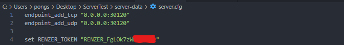

# Setup Token

:::info

 
การตั้งค่านี้ จะทำครั้งแรกและครั้งเดียวสำหรับลูกค้าที่ซื้อ Script ใหม่ เป็นครั้งแรก 

:::

<ol className="font-Noto">
  <li>ให้ล็อคอินที่เว็บไซต์ <a href="https://cfg.renzershop.com">cfg.renzershop.com</a> จากนั้นไปที่หน้า Dashboard จากนั้นให้ Copy ในส่วนของ Token</li>
  <li>เปิดไฟล์ <b>server.cfg</b> จากนั้นให้ว่างโค้ด <b>set RENZER_TOKEN "TOKEN"</b> ไว้ส่วนบน ต่อจาก endpoint_add_udp</li>
  <li>จากนั้นให้นำToken ที Copy มากจากเว็บไซต์ ไปใส่ใน RENZER_TOKEN</li>
</ol>

ตัวอย่าง

